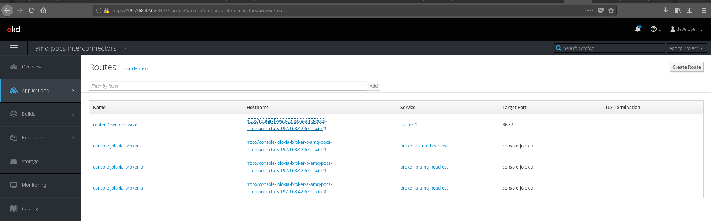
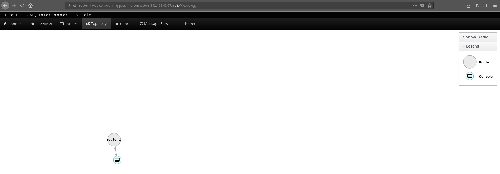

= POC ACTIVITIES

These are the activities related to installation of AMQ Brokers, AMQ Interconnect manually (ie. not provisioned as a service) and configurations for different topologies

Resources:

* link:https://developers.redhat.com/blog/2018/05/17/scaling-amq-7-brokers-with-amq-interconnect/[Scaling AMQ 7 Brokers with AMQ Interconnect] (Git Repo)
* link:https://www.youtube.com/watch?v=nVf5e97rvgQ[AMQ 7 and Microservices: Messaging for Everything] (Video)
* MAQ 7 Interconnectors:  link:https://access.redhat.com/documentation/en-us/red_hat_amq/7.2/html-single/using_amq_interconnect/#theory_of_operation[Theory of Operations] (Using Interconnect Guide)

== STAGE 1:  Install all necessary components (templates, images/streams) and preps

* Install amq-interconnect images

	$ oc get imagestreamtag -n openshift | grep amq-interconnect-1.2-openshift

	$ oc import-image amq-interconnect-1.2-openshift:latest -n openshift --from=registry.access.redhat.com/amq-interconnect/amq-interconnect-1.2-openshift --confirm

* Insstall templates

	(the templates are now also available also under /amq-7-templates)

	oc login -u system:admin
	curl https://raw.githubusercontent.com/jboss-container-images/amq-interconnect-1-openshift-image/amq-interconnect-11-dev/templates/amq-interconnect-1-basic.yaml | oc create -f - -n openshift
	curl https://raw.githubusercontent.com/jboss-container-images/amq-interconnect-1-openshift-image/amq-interconnect-11-dev/templates/amq-interconnect-1-tls-auth.yaml | oc create -f - -n openshift
	curl https://raw.githubusercontent.com/jboss-container-images/amq-interconnect-1-openshift-image/amq-interconnect-11-dev/templates/amq-interconnect-1-sasldb-auth.yaml | oc create -f - -n openshift

** Installing/Using Secured Interconnectors link:https://access.redhat.com/documentation/en-us/red_hat_amq/7.2/html-single/deploying_amq_interconnect_on_openshift_container_platform[Documentation here]. *We will be using basic*
*** Prepare SSL certs (If you want to secure inter-router traffic, client traffic, or both,)
*TODO*: Follow the link:https://access.redhat.com/documentation/en-us/red_hat_amq/7.2/html-single/deploying_amq_interconnect_on_openshift_container_platform/#creating-secrets-for-tls-authentication-preparing[Documentation]

*** Creating secrets for SASL authentication
To authenticate clients against user name and password pairs stored in a SASL database, you must create a list containing the user names and passwords, and provide it to OpenShift as a secret. 
*TODO*: Follow the link:https://access.redhat.com/documentation/en-us/red_hat_amq/7.2/html-single/deploying_amq_interconnect_on_openshift_container_platform/#Creating-secrets-for-sasl-authentication-preparing[Documentation]

== STAGE 2:  Perform Instalations of AMQ7 Brokers

Setting up 3 brokers which are Stateful Sets with single instance 

* *AMQ Broker - A* Deployment (*IMPORTANT*: This AMQ Broker contains Queue: *DemoQueue*)

	oc new-app --template=amq-broker-72-persistence \
        -p=APPLICATION_NAME=broker-a \
        -p=AMQ_ROLE=admin \
        -p=AMQ_NAME=broker-a \
        -p=AMQ_DATA_DIR=/opt/amq/data \
        -p=AMQ_DATA_DIR_LOGGING="true" \
        -p=IMAGE=registry.access.redhat.com/amq-broker-7/amq-broker-72-openshift:1.1 \
        -p=AMQ_PROTOCOL=openwire,amqp,stomp,mqtt,hornetq \
        -p=AMQ_QUEUES=demoQueue \
        -p=AMQ_ADDRESSES=demoTopic \
        -p=VOLUME_CAPACITY=1Gi \
        -p=AMQ_USER=amq-demo-user \
        -p=AMQ_PASSWORD=amqDemoPassword \
        -p=AMQ_REQUIRE_LOGIN="false" \
        -l app=brokers \
        -n amq-pocs-interconnectors

** *AMQ Broker - A* - OCP Route Exposing *jolokia* port for *AMQ7 Web Console* for this broker 

	echo 'apiVersion: v1
	kind: Route
	metadata:
	  labels:
	    app: broker-a
	    application: broker-a
	  name: console-jolokia-broker-a
	spec:
	  port:
	    targetPort: console-jolokia
	  to:
	    kind: Service
	    name: broker-a-amq-headless' | oc create -f - -n amq-pocs-interconnectors

** Delete before proceeding the *console-jolokia* route created by the template as they will be repeated by the others

	oc delete route console-jolokia

** *Test* access to the web console for *AMQ Broker - A*

	Login with amq-demo-user/amqDemoPassword on the link of the *console-jolokia-broker-a* route
	eg. http://console-jolokia-broker-a-amq-pocs-interconnectors.192.168.42.67.nip.io 

* *AMQ Broker - B* Deployment (*IMPORTANT*: This AMQ Broker contains 2 Queues *DemoQueue* and *dq2*)

	oc new-app --template=amq-broker-72-persistence \
        -p=APPLICATION_NAME=broker-b \
        -p=AMQ_ROLE=admin \
        -p=AMQ_NAME=broker-b \
        -p=AMQ_DATA_DIR=/opt/amq/data \
        -p=AMQ_DATA_DIR_LOGGING="true" \
        -p=IMAGE=registry.access.redhat.com/amq-broker-7/amq-broker-72-openshift:1.1 \
        -p=AMQ_PROTOCOL=openwire,amqp,stomp,mqtt,hornetq \
        -p=AMQ_QUEUES=demoQueue,dq2 \
        -p=AMQ_ADDRESSES=demoTopic \
        -p=VOLUME_CAPACITY=1Gi \
        -p=AMQ_USER=amq-demo-user \
        -p=AMQ_PASSWORD=amqDemoPassword \
        -p=AMQ_REQUIRE_LOGIN="false" \
        -l app=brokers \
        -n amq-pocs-interconnectors

** *AMQ Broker - B* - OCP Route Exposing *jolokia* port for *AMQ7 Web Console* on 
	
	echo 'apiVersion: v1
	kind: Route
	metadata:
	  labels:
	    app: broker-b
	    app: brokers
	    application: broker-b
	  name: console-jolokia-broker-b
	spec:
	  port:
	    targetPort: console-jolokia
	  to:
	    kind: Service
	    name: broker-b-amq-headless' | oc create -f - -n amq-pocs-interconnectors

** Delete before proceeding the *console-jolokia* route created by the template as they will be repeated by the others

	oc delete route console-jolokia

** *Test* access to the web console for *AMQ Broker - B*

	Login with amq-demo-user/amqDemoPassword on the link of the *console-jolokia-broker-b* route
	eg. http://console-jolokia-broker-b-amq-pocs-interconnectors.192.168.42.67.nip.io 

* *AMQ Broker - C* Deployment (*IMPORTANT*: This AMQ Broker contains Queue: *dq2*)

	oc new-app --template=amq-broker-72-persistence \
        -p=APPLICATION_NAME=broker-c \
        -p=AMQ_ROLE=admin \
        -p=AMQ_NAME=broker-c \
        -p=AMQ_DATA_DIR=/opt/amq/data \
        -p=AMQ_DATA_DIR_LOGGING="true" \
        -p=IMAGE=registry.access.redhat.com/amq-broker-7/amq-broker-72-openshift:1.1 \
        -p=AMQ_PROTOCOL=openwire,amqp,stomp,mqtt,hornetq \
        -p=AMQ_QUEUES=dq2 \
        -p=AMQ_ADDRESSES=demoTopic \
        -p=VOLUME_CAPACITY=1Gi \
        -p=AMQ_USER=amq-demo-user \
        -p=AMQ_PASSWORD=amqDemoPassword \
        -p=AMQ_REQUIRE_LOGIN="false" \
        -l app=brokers \
        -n amq-pocs-interconnectors

** *AMQ Broker - C* - OCP Route Exposing *jolokia* port for *AMQ7 Web Console* on 

	echo 'apiVersion: v1
	kind: Route
	metadata:
	  labels:
	    app: broker-c
	    app: brokers
	    application: broker-c
	  name: console-jolokia-broker-c
	spec:
	  port:
	    targetPort: console-jolokia
	  to:
	    kind: Service
	    name: broker-c-amq-headless' | oc create -f - -n amq-pocs-interconnectors

** Delete before proceeding the *console-jolokia* route created by the template as they will be repeated by the others

	oc delete route console-jolokia

** *Test* access to the web console for *AMQ Broker - C*

	Login with amq-demo-user/amqDemoPassword on the link of the *console-jolokia-broker-c* route
	eg. http://console-jolokia-broker-c-amq-pocs-interconnectors.192.168.42.67.nip.io 
	

== STAGE 3:  AMQ Interonnect Setup

=== Prerequisites

To deploy and test this topology, you should have 
* at least one AMQ 7 broker deployed and running on some host. If you have more instances, all of them should work in the same cluster definition.
* Samples will work with a set of queues that you should define in your AMQ 7 brokers. To do that, please add to address section of the  $AMQ_BROKER/etc/broker.xml file the following definitions (or as above via the template)
	
	<address name="DemoQueue">
	  <anycast>
	    <queue name="DemoQueue" />
	  </anycast>
	</address>

=== Install Interconnect Router-1

	You can inspect the interconnect template installed earlier
	oc describe template amq-interconnect-1-basic -n openshift

* Interconnect exposes the following ports (we will direct traffic to *5672 (AMQP no-auth)* and *8672 (web console)*

	Target Port.
	5672		External clients or message brokers to connect to the router mesh without authentication
	5671 		External clients or message brokers to connect to the router mesh with authentication
	55672		External routers to connect to the router mesh
	8672		Accessing the web console

* Create *router-1*

	oc new-app  --template=amq-interconnect-1-basic -pAPPLICATION_NAME=router-1 -l app=interconnect -n amq-pocs-non-ssl

* Create OCP Route to Interconnect *router-1* - WEB Console OCP Route (8672)

	echo 'apiVersion: route.openshift.io/v1
	kind: Route
	metadata:
	  labels:
	    application: router-1
	    app: interconnect 
	  name: router-1-web-console
	spec:
	  host: router-1-web-console-amq-pocs-interconnectors.192.168.42.67.nip.io
	  port:
	    targetPort: 8672
	  to:
	    kind: Service
	    name: router-1
	    weight: 100
	  wildcardPolicy: None
	status:
	  loadBalancer: {}' | oc create -f - -n amq-pocs-interconnectors

* Expose Interconnect *router-1* AMQP Port over service  (8672) (*IMPORTANT*: Using NodePort takes place due to inability to go over (8)443 with correct SSL certificates. *It is not recommended practice to use NodePort* instead use OCP Route with correct SSL certificates)

echo 'apiVersion: v1
	kind: Service
	metadata:
	  labels:
	    application: router-1
	    app: interconnect
	  name: router-1-external-tcp
	spec:
	  externalTrafficPolicy: Cluster
	  ports:
	   -  nodePort: 30002
	      port: 5672
	      protocol: TCP
	      targetPort: 5672
	  selector:
	    deploymentConfig: router-1
	  sessionAffinity: None
	  type: NodePort' | oc create -f - -n amq-pocs-interconnectors

=== Result - Initial Installation 

The outcome will be 3 routes which can be used to access the content of the *3 brokers* and the interconnect *router-1*

 

The topology in *router-1* web-console will be showing only the router and its console connected

 

Facility *qdstat* shows on the router pod 2 *in connections* from the console and the no-auth port

	$ oc exec router-1-1-dbb9h -it -- qdstat -c
	Connections
	  id  host             container                             role    dir  security     authentication  tenant
	  =============================================================================================================
	  2   172.17.0.1       bb15316c-db9a-e441-b4ca-e3d30ec34919  normal  in   no-security  no-auth         
	  3   127.0.0.1:60566  b63e1cd5-026c-41cf-907a-5c63471816f6  normal  in   no-security  no-auth     

=== Scenario 1

* Interconnect via *router-1* is going to be used for direct access to *broker-a* and *broker-b* addresses
** Configure interconnect *router-1* to access  *broker-a* and *broker-b*
** Configure interconnect *router-1* to give accss to address *DemoQueue* on *broker-a*
** Configure interconnect *router-1* to give accss to address *DemoQueue* on *broker-b*
** Configure interconnect *router-1* to give accss to address *dq2* on *WRONG-BROKER*

=== Install Interconnect Router-2

Configured Later (Scenario Interconnect with aggregators)

=== Install Interconnect Router-3

Configured Later (Scenario Interconnect with aggregators)

	
==== Create Router NO-AUTH TCP OCP Route (5672)
	apiVersion: route.openshift.io/v1
	kind: Route
	metadata:
	  labels:
	    app: amq-interconnect-1-basic
	    application: amq-interconnect-basic-1
	    template: amq-interconnect-1-basic
	  name: router-1-tcp-noauth
	  namespace: amq-online
	spec:
	  host: router-1-tcp-noauth-amq-online.192.168.42.196.nip.io
	  port:
	    targetPort: 5672
	  to:
	    kind: Service
	    name: amq-interconnect-basic-1
	    weight: 100
	  wildcardPolicy: None

	

=== Connecting clients to a router mesh

Procedure: To connect a client to the router mesh, use the following connection URL syntax:

    <scheme>://[<username>@]<host>[:<port>]

    <scheme>
        For unencrypted TCP, use amqp. If you deployed the router mesh with SSL/TLS authentication, use amqps. 
    <username>
        If you deployed the router mesh with SASL user name/password authentication, you must provide the client’s user name. 
    <host>
        If the client is in the same OpenShift cluster as the router mesh, use the OpenShift service IP address. Otherwise, use the host name of the route. 
    <port>
        If you are connecting to a route, you must specify the port. Use 80 for unsecured connections, and 443 for secured connections. 

    The following table shows some example connection URLs.
    URL	Description

    amqp://192.0.2.1
    	

    The client and router mesh are both in the same OpenShift cluster, so the service IP address is used for the connection URL.

    amqps://amq-interconnect-myproject.192.0.2.1.nip.io:443
    	

    The client is outside of OpenShift, so the route host name is used for the connection URL. In this case, SSL/TLS authentication is implemented, which requires the amqps scheme and port 443. 

== Connecting to a message broker (within OCP)

UPDATE:  amq-interconnect-basic-1

	connector {
	    name: broker
	    role: route-container
	    host: broker-amq-headless.amq-online.svc
	    port: 61616
	    saslMechanisms: ANONYMOUS
	}

	connector {
	    name: broker-a
	    role: route-container
	    host: broker-a-amq-headless.amq-online.svc
	    port: 61616
	    saslMechanisms: ANONYMOUS
	}

	connector {
	    name: broker-b
	    role: route-container
	    host: broker-b-amq-headless.amq-online.svc
	    port: 61616
	    saslMechanisms: ANONYMOUS
	}

redploy Interconnector

	2018-12-07 14:04:10.949379 +0000 CONN_MGR (info) Configured Connector: broker-amq-headless.amq-online.svc:61616 proto=any, role=route-container

	oc exec amq-interconnect-basic-1-2-h972z -it -- qdstat -c
	Connections
  	id  host                                      container                             role             dir  security     authentication  tenant
  	===============================================================================================================================================
  	1   broker-amq-headless.amq-online.svc:61616  broker                                route-container  out  no-security  anonymous-user  
  	2   127.0.0.1:33278                           11ef781d-7e5b-4464-875d-442b2c2a98c9  normal           in   no-security  no-auth    

=== Monitoring the router mesh using the web console
Docs: https://access.redhat.com/documentation/en-us/red_hat_amq/7.2/html-single/deploying_amq_interconnect_on_openshift_container_platform/#monitoring-router-mesh-using-web-console-managing

	$ oc exec amq-interconnect-basic-1-5-cjnct -it -- qdstat -c
	Connections
	  id  host                                        container                             role             dir  security     authentication  tenant
	  =================================================================================================================================================
	  3   broker-amq-headless.amq-online.svc:61616    broker                                route-container  out  no-security  anonymous-user  
	  1   broker-b-amq-headless.amq-online.svc:61616  broker                                route-container  out  no-security  anonymous-user  
	  2   broker-a-amq-headless.amq-online.svc:61616  broker                                route-container  out  no-security  anonymous-user  
	  4   172.17.0.1                                  417b6d34-8dfa-f74c-b186-964451d361a5  normal           in   no-security  no-auth         
	  5   127.0.0.1:46548                             1a30623d-e6f6-474a-a52b-02e67dbb20ad  normal           in   no-security  no-auth

== Scaling the router mesh

You can scale your deployment to add or remove routers from the router mesh. When you scale up the router mesh, a new pod is deployed with a router, which automatically connects to any other running routers.

Procedure

    Navigate to the Overview page.

    Do one of the following:

        To add routers to the mesh, click the up arrow next to the pods diagram.

        A new pod is deployed, with a router running inside of it. The router automatically connects to each router in the mesh to maintain a full mesh topology.

        To remove routes from the mesh, click the down arrow next to the pods diagram.

        A pod is removed from the deployment, and its router is shut down. Any clients that were connected to the router are disconnected, but can fail over to any of the remaining routers in the mesh. 

== STAGE 4:  AMQ Interonnect Topology Scenarios

This is to showcase some features of the Interconnect

=== Install Router Type: Aggregator Router

This router will manage the incoming and outgoing messages from other routers to the AMQ 7 HA cluster topology behind it.

=== Install Router Type: Producer Router

This router will manage the incoming messages from producers to the aggregator router.

=== Install Router Type: Consumer Router

This router will manage the outgoing messages from the aggregator router to the consumer router.

