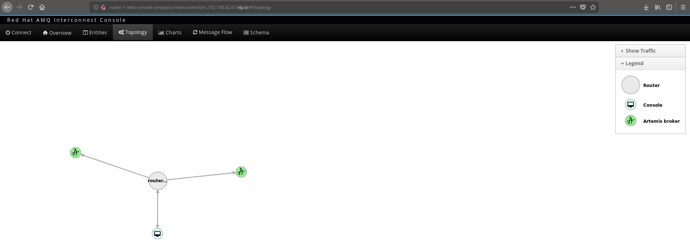
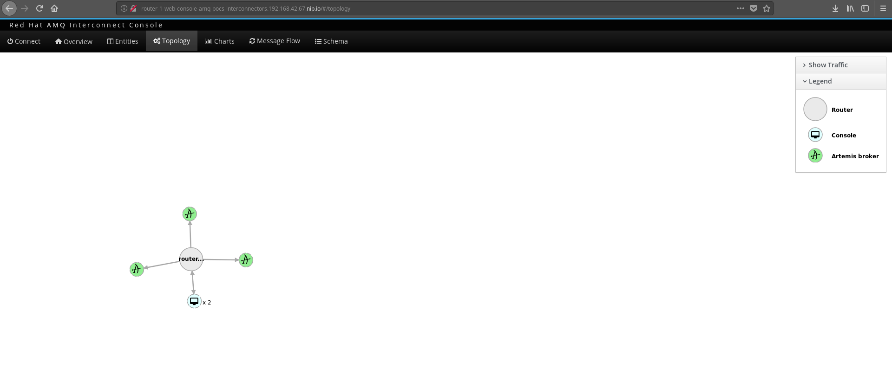
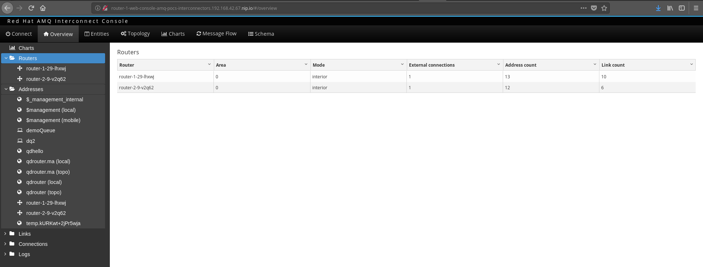
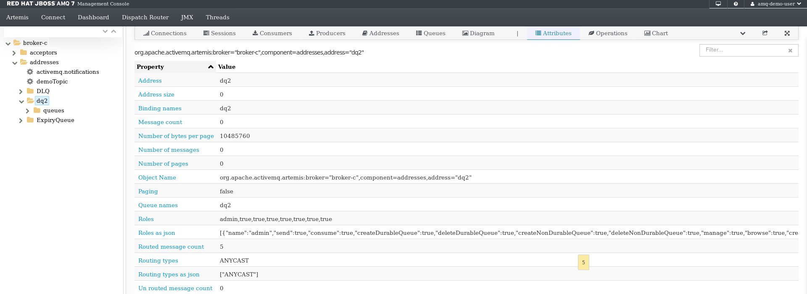
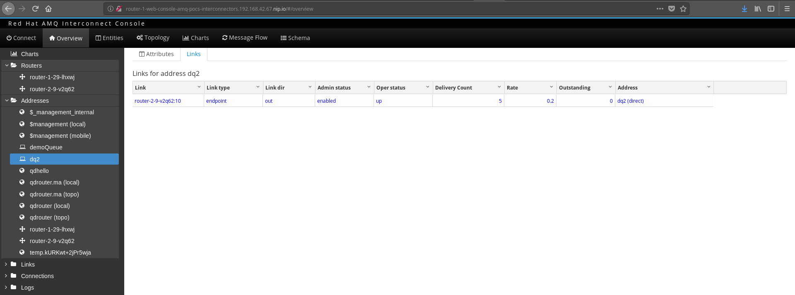
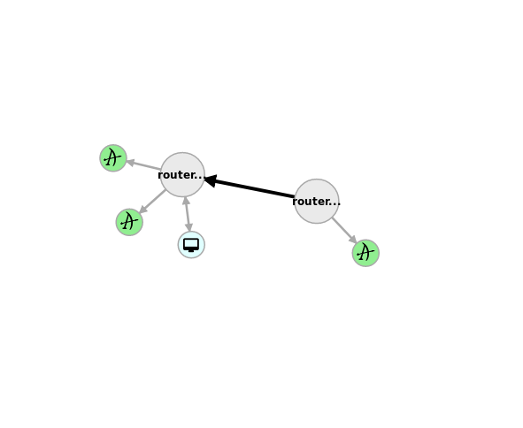
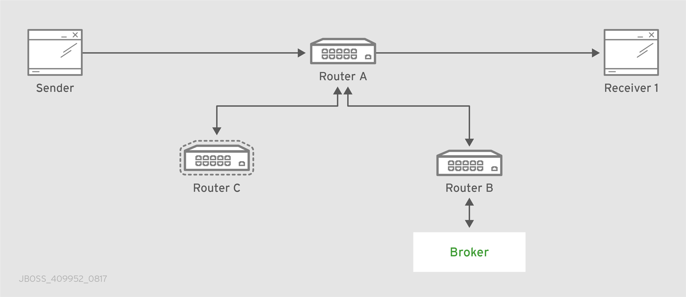

= POC ACTIVITIES

These are the activities related to installation of AMQ Brokers, AMQ Interconnect manually (ie. not provisioned as a service) and configurations for different topologies

Resources:

* link:https://developers.redhat.com/blog/2018/05/17/scaling-amq-7-brokers-with-amq-interconnect/[Scaling AMQ 7 Brokers with AMQ Interconnect] (Git Repo)
* link:https://www.youtube.com/watch?v=nVf5e97rvgQ[AMQ 7 and Microservices: Messaging for Everything] (Video)
* AMQ 7 Interconnectors:  link:https://access.redhat.com/documentation/en-us/red_hat_amq/7.2/html-single/using_amq_interconnect/#theory_of_operation[Theory of Operations] (Using Interconnect Guide)

== STAGE 1:  Install all necessary components (templates, images/streams) and preps

* Install amq-interconnect images

	$ oc get imagestreamtag -n openshift | grep amq-interconnect-1.2-openshift

	$ oc import-image amq-interconnect-1.2-openshift:latest -n openshift --from=registry.access.redhat.com/amq-interconnect/amq-interconnect-1.2-openshift --confirm

* Insstall templates

	(the templates are now also available also under /amq-7-templates)

	oc login -u system:admin
	curl https://raw.githubusercontent.com/jboss-container-images/amq-interconnect-1-openshift-image/amq-interconnect-11-dev/templates/amq-interconnect-1-basic.yaml | oc create -f - -n openshift
	curl https://raw.githubusercontent.com/jboss-container-images/amq-interconnect-1-openshift-image/amq-interconnect-11-dev/templates/amq-interconnect-1-tls-auth.yaml | oc create -f - -n openshift
	curl https://raw.githubusercontent.com/jboss-container-images/amq-interconnect-1-openshift-image/amq-interconnect-11-dev/templates/amq-interconnect-1-sasldb-auth.yaml | oc create -f - -n openshift

** Installing/Using Secured Interconnectors link:https://access.redhat.com/documentation/en-us/red_hat_amq/7.2/html-single/deploying_amq_interconnect_on_openshift_container_platform[Documentation here]. *We will be using basic*
*** Prepare SSL certs (If you want to secure inter-router traffic, client traffic, or both,)
*TODO*: Follow the link:https://access.redhat.com/documentation/en-us/red_hat_amq/7.2/html-single/deploying_amq_interconnect_on_openshift_container_platform/#creating-secrets-for-tls-authentication-preparing[Documentation]

*** Creating secrets for SASL authentication
To authenticate clients against user name and password pairs stored in a SASL database, you must create a list containing the user names and passwords, and provide it to OpenShift as a secret. 
*TODO*: Follow the link:https://access.redhat.com/documentation/en-us/red_hat_amq/7.2/html-single/deploying_amq_interconnect_on_openshift_container_platform/#Creating-secrets-for-sasl-authentication-preparing[Documentation]

== STAGE 2:  Perform Instalations of AMQ7 Brokers

Setting up 3 brokers which are Stateful Sets with single instance 

* *AMQ Broker - A* Deployment (*IMPORTANT*: This AMQ Broker contains Queue: *demoQueue*)

	oc new-app --template=amq-broker-72-persistence \
        -p=APPLICATION_NAME=broker-a \
        -p=AMQ_ROLE=admin \
        -p=AMQ_NAME=broker-a \
        -p=AMQ_DATA_DIR=/opt/amq/data \
        -p=AMQ_DATA_DIR_LOGGING="true" \
        -p=IMAGE=registry.access.redhat.com/amq-broker-7/amq-broker-72-openshift:1.1 \
        -p=AMQ_PROTOCOL=openwire,amqp,stomp,mqtt,hornetq \
        -p=AMQ_QUEUES=demoQueue \
        -p=AMQ_ADDRESSES=demoTopic \
        -p=VOLUME_CAPACITY=1Gi \
        -p=AMQ_USER=amq-demo-user \
        -p=AMQ_PASSWORD=amqDemoPassword \
        -p=AMQ_REQUIRE_LOGIN="false" \
        -l app=brokers \
        -n amq-pocs-interconnectors

** *AMQ Broker - A* - OCP Route Exposing *jolokia* port for *AMQ7 Web Console* for this broker 

	echo 'apiVersion: v1
	kind: Route
	metadata:
	  labels:
	    app: broker-a
	    application: broker-a
	  name: console-jolokia-broker-a
	spec:
	  port:
	    targetPort: console-jolokia
	  to:
	    kind: Service
	    name: broker-a-amq-headless' | oc create -f - -n amq-pocs-interconnectors

** Delete before proceeding the *console-jolokia* route created by the template as they will be repeated by the others

	oc delete route console-jolokia

** *Test* access to the web console for *AMQ Broker - A*

	Login with amq-demo-user/amqDemoPassword on the link of the *console-jolokia-broker-a* route
	eg. http://console-jolokia-broker-a-amq-pocs-interconnectors.192.168.42.67.nip.io 

* *AMQ Broker - B* Deployment (*IMPORTANT*: This AMQ Broker contains 2 Queues *demoQueue* and *dq2*)

	oc new-app --template=amq-broker-72-persistence \
        -p=APPLICATION_NAME=broker-b \
        -p=AMQ_ROLE=admin \
        -p=AMQ_NAME=broker-b \
        -p=AMQ_DATA_DIR=/opt/amq/data \
        -p=AMQ_DATA_DIR_LOGGING="true" \
        -p=IMAGE=registry.access.redhat.com/amq-broker-7/amq-broker-72-openshift:1.1 \
        -p=AMQ_PROTOCOL=openwire,amqp,stomp,mqtt,hornetq \
        -p=AMQ_QUEUES=demoQueue,dq2 \
        -p=AMQ_ADDRESSES=demoTopic \
        -p=VOLUME_CAPACITY=1Gi \
        -p=AMQ_USER=amq-demo-user \
        -p=AMQ_PASSWORD=amqDemoPassword \
        -p=AMQ_REQUIRE_LOGIN="false" \
        -l app=brokers \
        -n amq-pocs-interconnectors

** *AMQ Broker - B* - OCP Route Exposing *jolokia* port for *AMQ7 Web Console* on 
	
	echo 'apiVersion: v1
	kind: Route
	metadata:
	  labels:
	    app: broker-b
	    app: brokers
	    application: broker-b
	  name: console-jolokia-broker-b
	spec:
	  port:
	    targetPort: console-jolokia
	  to:
	    kind: Service
	    name: broker-b-amq-headless' | oc create -f - -n amq-pocs-interconnectors

** Delete before proceeding the *console-jolokia* route created by the template as they will be repeated by the others

	oc delete route console-jolokia

** *Test* access to the web console for *AMQ Broker - B*

	Login with amq-demo-user/amqDemoPassword on the link of the *console-jolokia-broker-b* route
	eg. http://console-jolokia-broker-b-amq-pocs-interconnectors.192.168.42.67.nip.io 

* *AMQ Broker - C* Deployment (*IMPORTANT*: This AMQ Broker contains Queue: *dq2*)

	oc new-app --template=amq-broker-72-persistence \
        -p=APPLICATION_NAME=broker-c \
        -p=AMQ_ROLE=admin \
        -p=AMQ_NAME=broker-c \
        -p=AMQ_DATA_DIR=/opt/amq/data \
        -p=AMQ_DATA_DIR_LOGGING="true" \
        -p=IMAGE=registry.access.redhat.com/amq-broker-7/amq-broker-72-openshift:1.1 \
        -p=AMQ_PROTOCOL=openwire,amqp,stomp,mqtt,hornetq \
        -p=AMQ_QUEUES=dq2 \
        -p=AMQ_ADDRESSES=demoTopic \
        -p=VOLUME_CAPACITY=1Gi \
        -p=AMQ_USER=amq-demo-user \
        -p=AMQ_PASSWORD=amqDemoPassword \
        -p=AMQ_REQUIRE_LOGIN="false" \
        -l app=brokers \
        -n amq-pocs-interconnectors

** *AMQ Broker - C* - OCP Route Exposing *jolokia* port for *AMQ7 Web Console* on 

	echo 'apiVersion: v1
	kind: Route
	metadata:
	  labels:
	    app: broker-c
	    app: brokers
	    application: broker-c
	  name: console-jolokia-broker-c
	spec:
	  port:
	    targetPort: console-jolokia
	  to:
	    kind: Service
	    name: broker-c-amq-headless' | oc create -f - -n amq-pocs-interconnectors

** Delete before proceeding the *console-jolokia* route created by the template as they will be repeated by the others

	oc delete route console-jolokia

** *Test* access to the web console for *AMQ Broker - C*

	Login with amq-demo-user/amqDemoPassword on the link of the *console-jolokia-broker-c* route
	eg. http://console-jolokia-broker-c-amq-pocs-interconnectors.192.168.42.67.nip.io 
	

== Connecting clients to a router mesh

* Procedure: To connect a client to the router mesh, use the following connection URL syntax:
* *<scheme>://[<username>@]<host>[:<port>]*
* *<scheme>*	For unencrypted TCP, use amqp. If you deployed the router mesh with SSL/TLS authentication, use amqps. 
* *<username>*    If you deployed the router mesh with SASL user name/password authentication, you must provide the client’s user name. 
* *<host>*        If the client is in the same OpenShift cluster as the router mesh, use the OpenShift service IP address. Otherwise, use the host name of the route. 
* *<port>*        If you are connecting to a route, you must specify the port. Use 80 for unsecured connections, and 443 for secured connections. 

    The following table shows some example connection URLs.
    URL	Description    amqp://192.0.2.1
    	

    The client and router mesh are both in the same OpenShift cluster, so the service IP address is used for the connection URL.
    amqps://amq-interconnect-myproject.192.0.2.1.nip.io:443   	

    The client is outside of OpenShift, so the route host name is used for the connection URL. In this case, SSL/TLS authentication is implemented, which requires the amqps scheme and port 443. (or NodePort service)

== STAGE 3:  AMQ Interonnect Setup

=== Prerequisites

To deploy and test this topology, you should have 

* at least one AMQ 7 broker deployed and running on some host. If you have more instances, all of them should work in the same cluster definition.
* Samples will work with a set of queues that you should define in your AMQ 7 brokers. To do that, please add to address section of the  $AMQ_BROKER/etc/broker.xml file the following definitions (or as above via the template)
	
	<address name="demoQueue">
	  <anycast>
	    <queue name="demoQueue" />
	  </anycast>
	</address>

=== Install Interconnect Router-1

	You can inspect the interconnect template installed earlier
	oc describe template amq-interconnect-1-basic -n openshift

* Interconnect exposes the following ports (we will direct traffic to *5672 (AMQP no-auth)* and *8672 (web console)*

	Target Port.
	5672		External clients or message brokers to connect to the router mesh without authentication
	5671 		External clients or message brokers to connect to the router mesh with authentication
	55672		External routers to connect to the router mesh
	8672		Accessing the web console

* Create *router-1*

	oc new-app  --template=amq-interconnect-1-basic -pAPPLICATION_NAME=router-1 -l app=interconnect -n amq-pocs-interconnectors

* Create OCP Route to Interconnect *router-1* - WEB Console OCP Route (8672)

	echo 'apiVersion: route.openshift.io/v1
	kind: Route
	metadata:
	  labels:
	    application: router-1
	    app: interconnect 
	  name: router-1-web-console
	spec:
	  host: router-1-web-console-amq-pocs-interconnectors.192.168.42.67.nip.io
	  port:
	    targetPort: 8672
	  to:
	    kind: Service
	    name: router-1
	    weight: 100
	  wildcardPolicy: None
	status:
	  loadBalancer: {}' | oc create -f - -n amq-pocs-interconnectors

* Expose Interconnect *router-1* AMQP Port over service  (8672) (*IMPORTANT*: Using NodePort takes place due to inability to go over (8)443 with correct SSL certificates. *It is not recommended practice to use NodePort* instead use OCP Route with correct SSL certificates)

	echo 'apiVersion: v1
	kind: Service
	metadata:
	  labels:
	    application: router-1
	    app: interconnect
	  name: router-1-external-tcp
	spec:
	  externalTrafficPolicy: Cluster
	  ports:
	   -  nodePort: 30002
	      port: 5672
	      protocol: TCP
	      targetPort: 5672
	  selector:
	    deploymentConfig: router-1
	  sessionAffinity: None
	  type: NodePort' | oc create -f - -n amq-pocs-interconnectors

==== Result - Initial Installation 

The outcome will be 3 routes which can be used to access the content of the *3 brokers* and the interconnect *router-1*

image:pics/amq-interconnect-Routes-interconnect-1-brokers-3-consoles.png["Routes for Consoles",height=240] 

The topology in *router-1* web-console will be showing only the router and its console connected

image:pics/amq-interconnect-console-router-1.png["Topology Initial",height=240] 

Facility *qdstat* shows on the router pod 2 *in connections* from the console and the no-auth port

	$ oc exec router-1-1-dbb9h -it -- qdstat -c
	Connections
	  id  host             container                             role    dir  security     authentication  tenant
	  =============================================================================================================
	  2   172.17.0.1       bb15316c-db9a-e441-b4ca-e3d30ec34919  normal  in   no-security  no-auth         
	  3   127.0.0.1:60566  b63e1cd5-026c-41cf-907a-5c63471816f6  normal  in   no-security  no-auth     

=== Test Interconnect Scenario 1

*Aim: Showcase transparrent connection to brokers via interconnect for both brokered and direct communications*

* Interconnect via *router-1* is going to be used for direct access to *broker-a* and *broker-b* addresses
** Configure interconnect *router-1* to access  *broker-a* and *broker-b*

	Either via the OCP console access Resources-->Config Maps-->router-1 (click on it, Actions, Edit Yaml) add the following
	or
	oc edit cm router-1

    connector {        
       name: broker-a
       role: route-container
       host: broker-a-amq-headless.amq-pocs-interconnectors.svc   
       port: 61616
       saslMechanisms: ANONYMOUS
    }

    connector {
       name: broker-b
       role: route-container
       host: broker-b-amq-headless.amq-pocs-interconnectors.svc   
       port: 61616
       saslMechanisms: ANONYMOUS
    }

** Configure interconnect *router-1* to give access to address *demoQueue* on *broker-a* (both in/out ie. write/read)

    linkRoute {
       prefix: demoQueue
       connection: broker-a
       direction: in
    }

    linkRoute {
       prefix: demoQueue
       connection: broker-a
       direction: out
    }

** Configure interconnect *router-1* to give access to address *demoQueue* on *broker-b* (both in/out ie. write/read)

    linkRoute {
       prefix: demoQueue
       connection: broker-b
       direction: in
    }

    linkRoute {
       prefix: demoQueue
       connection: broker-b
       direction: out
    }

** No Configuraton on interconnect *router-1* to give access to address *dq2* 

** Go to OCP console on Applications-->Deployments-->router-1 (Press the *Deploy*) to take effect on the changes

* *Test-1* - Sending messages repeatedly to address *demoQueue* (by executing the following) results in the router "loadbalancing" writes/reads between  *broker-a* and *broker-b* (verify by looking at both on Queue *demoQueue* and the number of messages written/acknowledged/read)

	cd ocp-amq7-poc/clients/jms/apache-qpid-jms-0.37.0.redhat-00001/examples/
	java -DUSER="amq-demo-user" -DPASSWORD="amqDemoPassword" -cp "target/classes/:target/dependency/*" org.apache.qpid.jms.example.HelloWorld

	Ensure ocp-amq7-poc/clients/jms/apache-qpid-jms-0.37.0.redhat-00001/examples/target/classes/jndi.properties|-
			java.naming.factory.initial = org.apache.qpid.jms.jndi.JmsInitialContextFactory
			connectionfactory.myFactoryLookup = amqp://192.168.42.67:30002
			queue.myQueueLookup = demoQueue
			topic.myTopicLookup = demoTopic

* *Test-2* - Sending messages repeatedly to address *dq2* (by executing the following) results in the router correctly routing back a response to the *producer/consumer* HelloWorld program

	cd ocp-amq7-poc/clients/jms/apache-qpid-jms-0.37.0.redhat-00001-dq2/examples/
	java -DUSER="amq-demo-user" -DPASSWORD="amqDemoPassword" -cp "target/classes/:target/dependency/*" org.apache.qpid.jms.example.HelloWorld

	Ensure ocp-amq7-poc/clients/jms/apache-qpid-jms-0.37.0.redhat-00001/examples/target/classes/jndi.properties|-
			java.naming.factory.initial = org.apache.qpid.jms.jndi.JmsInitialContextFactory
			connectionfactory.myFactoryLookup = amqp://192.168.42.67:30002
			queue.myQueueLookup = dq2
			topic.myTopicLookup = demoTopic

	*IMPORTANT*: the way this works is because both the consumer & producer are connected at the time and the *router-1* routes the message directly

* Resulting Topology

	The topology in *router-1* web-console will now be showing the router and its console connected as well as the the 2 AMQ7 Brokers connected

 

** Facility *qdstat* shows on the router pod 
*** 2 *in connections* from the console and the no-auth port as well as
*** 2 *out connections* to the 2 brokers

	$ oc exec router-1-3-7pzxm -it -- qdstat -c
	Connections
	  id  host                                                      container                             role             dir  security     authentication  tenant
	  ===============================================================================================================================================================
	  1   broker-b-amq-headless.amq-pocs-interconnectors.svc:61616  broker-b                              route-container  out  no-security  anonymous-user  
	  2   broker-a-amq-headless.amq-pocs-interconnectors.svc:61616  broker-a                              route-container  out  no-security  anonymous-user  
	  4   172.17.0.1                                                ee38c357-38ec-c745-a705-785974f87f55  normal           in   no-security  no-auth         
	  5   127.0.0.1:56206                                           a37d825e-78db-4243-98d6-80aa91e52cfb  normal           in   no-security  no-auth         

*Important:* To understand the behavior better around this loadbalancing and routing look at the documentation link:https://access.redhat.com/documentation/en-us/red_hat_amq/7.2/html-single/using_amq_interconnect/#message_routing[Message Routing] and read again the latter setions of the ConfigMap to see the address routing pre-configurations

---

=== Test Interconnect Scenario 2

*Aim: Showcase no changes to end-clients whilst topology changes behind the interconnect*

* Interconnect via *router-1* is going to be used for direct access to *broker-a* and *broker-b* and *broker-c* addresses
** All configs remain as in Scenario
** Configure interconnect *router-1* to access in addition *broker-c* and *broker-b*

    Either via the OCP console access Resources-->Config Maps-->router-1 (click on it, Actions, Edit Yaml) add the following
    or
    oc edit cm router-1

    connector {        
       name: broker-c
       role: route-container
       host: broker-c-amq-headless.amq-pocs-interconnectors.svc   
       port: 61616
       saslMechanisms: ANONYMOUS
    }

** Configure interconnect *router-1* to give access to address *dq2* on *broker-c* (both in/out ie. write/read) - This would showcase no changes to end-clients whilst topology changes behind the interconnect

    linkRoute {
       prefix: dq2
       connection: broker-c
       direction: in
    }

    linkRoute {
       prefix: dq2
       connection: broker-c
       direction: out
    }

** Go to OCP console on Applications-->Deployments-->router-1 (Press the *Deploy*) to take effect on the changes

* *Test-1* - Sending messages repeatedly to address *dq2* (by executing the following) results in the router correctly routing messages to *broker-c* (verify by looking at both on Queue *dq2* and the number of messages written/acknowledged/read)

	cd ocp-amq7-poc/clients/jms/apache-qpid-jms-0.37.0.redhat-00001-dq2/examples/
	java -DUSER="amq-demo-user" -DPASSWORD="amqDemoPassword" -cp "target/classes/:target/dependency/*" org.apache.qpid.jms.example.HelloWorld

	Ensure ocp-amq7-poc/clients/jms/apache-qpid-jms-0.37.0.redhat-00001/examples/target/classes/jndi.properties|-
			java.naming.factory.initial = org.apache.qpid.jms.jndi.JmsInitialContextFactory
			connectionfactory.myFactoryLookup = amqp://192.168.42.67:30002
			queue.myQueueLookup = dq2
			topic.myTopicLookup = demoTopic

* Resulting Topology
** The topology in *router-1* web-console will now be showing the router and its console connected as well as the the 2 AMQ7 Brokers connected

 

** Facility *qdstat* shows on the router pod 
*** 2 *in connections* from the console and the no-auth port as well as
*** 3 *out connections* to the 3 brokers

	$ oc exec router-1-4-q8pkj -it -- qdstat -c
	Connections
	  id  host                                                      container                             role             dir  security     authentication  tenant
	  ===============================================================================================================================================================
	  2   broker-b-amq-headless.amq-pocs-interconnectors.svc:61616  broker-b                              route-container  out  no-security  anonymous-user  
	  3   broker-a-amq-headless.amq-pocs-interconnectors.svc:61616  broker-a                              route-container  out  no-security  anonymous-user  
	  1   broker-c-amq-headless.amq-pocs-interconnectors.svc:61616  broker-c                              route-container  out  no-security  anonymous-user  
	  6   172.17.0.1                                                9367ab84-200b-6044-a4de-ed89f622a416  normal           in   no-security  no-auth         
	  8   127.0.0.1:53270                                           47056f3e-a647-4076-bb9b-a7583f3fbf3e  normal           in   no-security  no-auth 

** *RESULT*: Successfully changed so that
*** brokers increased from 2 to 3
*** dq2 can now be located on broker-c
*** without changing clients

---

=== Test Interconnect Scenario 3

*Aim: Showcase no changes to end-clients whilst topology changes behind the interconnect*

* Resources Read
** What is link:https://qpid.apache.org/releases/qpid-dispatch-1.2.0/man/qdrouterd.conf.html#_autolink[autoLink configuration]
** What are link:https://qpid.apache.org/releases/qpid-dispatch-1.2.0/man/qdrouterd.conf.html#_address[waypoint addresses]
** Differences between link:https://access.redhat.com/documentation/en-us/red_hat_amq/7.2/html-single/using_amq_interconnect/#addresses[mobile and link route addresses]

* Interconnect via *router-1* is going to be used for direct access to *broker-a* and *broker-b* and *broker-c* addresses
** All configs to remain as in Scenario
** Configure interconnect *router-1* to give access to address:
*** *demoQueue* on on *broker-a* and *broker-b* via *autoLink* (mobile Address) 

    Either via the OCP console access Resources-->Config Maps-->router-1 (click on it, Actions, Edit Yaml) add the following
    or
    oc edit cm router-1

    address {
      prefix: demoQueue
      waypoint: yes
    }

    autoLink {
       addr: demoQueue
       connection: broker-a
       direction: in
    }

    autoLink {
       addr: demoQueue
       connection: broker-a
       direction: out
    }

    autoLink {
       addr: demoQueue
       connection: broker-b
       direction: in
    }

    autoLink {
       addr: demoQueue
       connection: broker-b
       direction: out
    }

***  *dq2* on *broker-c* (both in/out ie. write/read) 

    address {
      prefix: dq2
      waypoint: yes
    }

    autoLink {
       addr: dq2
       connection: broker-c
       direction: in
    }

    autoLink {
       addr: dq2
       connection: broker-c
       direction: out
    }

** Go to OCP console on Applications-->Deployments-->router-1 (Press the *Deploy*) to take effect on the changes

* *Test-1* - Sending messages repeatedly to address *demoQueue* (by executing the following) results in the router "loadbalancing" writes/reads between  *broker-a* and *broker-b* (verify by looking at both on Queue *demoQueue* and the number of messages written/acknowledged/read)

	cd ocp-amq7-poc/clients/jms/apache-qpid-jms-0.37.0.redhat-00001/examples/
	java -DUSER="amq-demo-user" -DPASSWORD="amqDemoPassword" -cp "target/classes/:target/dependency/*" org.apache.qpid.jms.example.HelloWorld

	Ensure ocp-amq7-poc/clients/jms/apache-qpid-jms-0.37.0.redhat-00001/examples/target/classes/jndi.properties|-
			java.naming.factory.initial = org.apache.qpid.jms.jndi.JmsInitialContextFactory
			connectionfactory.myFactoryLookup = amqp://192.168.42.67:30002
			queue.myQueueLookup = demoQueue
			topic.myTopicLookup = demoTopic

* *Test-2* - Sending messages repeatedly to address *dq2* (by executing the following) results in the router correctly routing messages to *broker-c* (verify by looking at both on Queue *dq2* and the number of messages written/acknowledged/read)

	cd ocp-amq7-poc/clients/jms/apache-qpid-jms-0.37.0.redhat-00001-dq2/examples/
	java -DUSER="amq-demo-user" -DPASSWORD="amqDemoPassword" -cp "target/classes/:target/dependency/*" org.apache.qpid.jms.example.HelloWorld

	Ensure ocp-amq7-poc/clients/jms/apache-qpid-jms-0.37.0.redhat-00001/examples/target/classes/jndi.properties|-
			java.naming.factory.initial = org.apache.qpid.jms.jndi.JmsInitialContextFactory
			connectionfactory.myFactoryLookup = amqp://192.168.42.67:30002
			queue.myQueueLookup = dq2
			topic.myTopicLookup = demoTopic

* Resulting Topology

The topology in *router-1* web-console will now be showing the router and its console connected as well as the the 2 AMQ7 Brokers connected

** Facility *qdstat* shows on the router pod 
*** 2 *in connections* from the console and the no-auth port as well as
*** 2 *out connections* to the 2 brokers

	$ oc exec router-1-8-fz2n9 -it -- qdstat -c
	Connections
	  id  host                                                      container                             role             dir  security     authentication  tenant
	  ===============================================================================================================================================================
	  1   broker-c-amq-headless.amq-pocs-interconnectors.svc:61616  broker-c                              route-container  out  no-security  anonymous-user  
	  2   broker-b-amq-headless.amq-pocs-interconnectors.svc:61616  broker-b                              route-container  out  no-security  anonymous-user  
	  3   broker-a-amq-headless.amq-pocs-interconnectors.svc:61616  broker-a                              route-container  out  no-security  anonymous-user  
	  6   172.17.0.1                                                b24bd2e9-a818-e246-950c-d65d422fb04f  normal           in   no-security  no-auth         
	  11  127.0.0.1:43524                                           bb36e3c2-54c6-4bf9-895a-09a40eda1b82  normal           in   no-security  no-auth    

*** 6 AutoLinks

	$ oc exec router-1-8-fz2n9 -it -- qdstat --autolinks
	AutoLinks
	  addr       dir  phs  extAddr  link  status  lastErr
	  =====================================================
	  demoQueue  in   1             18    active  
	  demoQueue  out  0             19    active  
	  demoQueue  in   1             16    active  
	  demoQueue  out  0             17    active  
	  dq2        in   1             14    active  
	  dq2        out  0             15    active 

** *RESULT*: Successfully changed so that
*** brokers remain to 3
*** demoQueue messages loadbalanced between *broker-a* and *broker-b*
*** dq2 can now be located on *broker-c*
*** without changing clients

---

=== Test Interconnect Scenario 4

*Aim: Showcase redundant interconnect topology with multiple routers not containing all links*

Now create a mesh with autoLink (ie. links can exist before queue objects exist on the brokers and can autoLink when the objects are created) to the addresses and adding a new router-2 and maybe router-3 so that not only one router contains links to brokers

* Update *router-1* to ensure there is a waypoint 

    address {
        prefix: dq2
        waypoint: yes
    }
** *Note*: Although the waypoint is required in order to find its way to *router-2* configuration of the *dq2* link it canbe covered with a generic *_address format prefix_* so it is not necessary to define for its new address name

* Create *router-2*

	oc new-app  --template=amq-interconnect-1-basic -pAPPLICATION_NAME=router-2 -l app=interconnect -n amq-pocs-interconnectors

* Configure *inter-router* connectivity

** ConfigMap *router-1*

    listener {
      host: router-1.amq-pocs-interconnectors.svc
      port: 55672
      role: inter-router
      authenticatePeer: no
      saslMechanisms: ANONYMOUS
    }
    
    connector {
      name: INTER_ROUTER_B
      addr: router-2.amq-pocs-interconnectors.svc
      port: 55672
      role: inter-router
    }    

** ConfigMap *router-2*

    listener {
      host: router-2.amq-pocs-interconnectors.svc
      port: 55672
      role: inter-router
      authenticatePeer: no
      saslMechanisms: ANONYMOUS
    }

* Create OCP Route to Interconnect *router-2* - WEB Console OCP Route (8672)

	echo 'apiVersion: route.openshift.io/v1
	kind: Route
	metadata:
	  labels:
	    application: router-2
	    app: interconnect 
	  name: router-2-web-console
	spec:
	  host: router-2-web-console-amq-pocs-interconnectors.192.168.42.67.nip.io
	  port:
	    targetPort: 8672
	  to:
	    kind: Service
	    name: router-2
	    weight: 100
	  wildcardPolicy: None
	status:
	  loadBalancer: {}' | oc create -f - -n amq-pocs-interconnectors

* Not Exposing Interconnect *router-2* AMQP Port over service  (8672) only *router-1* will still be accessible by the client with the difference that *dq2* address links will be moved to *router-2* but shouldn't affect the client

==== Result - Redundant Interconnect Topology

* The outcome will be 2 routes which can be used to access the content of the *3 brokers* and the interconnect *router-1*
* The topology created in the mesh will be image:pics/amq-interconnect-Routes-interconnect-1-brokers-3-consoles.png["Routes for Consoles",height=240] 
* The console consolidates queues from all connected routers without need for multiple consoles, as seen here:  
* The *broker-c* console showing messages delivered to *dq2* accessible only via *router-2* when client is connecting to *router-1* 
* Routers console showing the messages being delviered to address *dq2* via the POD for *router-2* 

* The topology in *router-1* web-console will be showing only the router and its console connected  

Facility *qdstat* shows on the *router-2* POD *in connections* from the console and then a *bi-directional* connection to *router-1* as well as to *broker-c*

	$ oc exec router-2-9-v2q62  -it -- qdstat -c
	Connections
  	id  host                                                      container                             role             dir  security     authentication  tenant
  	===============================================================================================================================================================
  	13  broker-c-amq-headless.amq-pocs-interconnectors.svc:61616  broker-c                              route-container  out  no-security  anonymous-user  
  	33  router-1.amq-pocs-interconnectors.svc:55672               router-1-29-lhxwj                     inter-router     out  no-security  anonymous-user  
 	34  127.0.0.1:43130                         

Facility *qdstat* shows on the *router-1* POD *in connections* from the console and then a *bi-directional* connection to *router-2* as well as to *broker-a* and *broker-b*

	$ oc exec router-1-29-lhxwj  -it -- qdstat -c
	Connections
	  id  host                                                      container                             role             dir  security     authentication  tenant
	  ===============================================================================================================================================================
	  1   broker-b-amq-headless.amq-pocs-interconnectors.svc:61616  broker-b                              route-container  out  no-security  anonymous-user  
	  2   broker-a-amq-headless.amq-pocs-interconnectors.svc:61616  broker-a                              route-container  out  no-security  anonymous-user  
	  4   172.17.0.10:38284                                         router-2-9-v2q62                      inter-router     in   no-security  anonymous-user  
	  6   172.17.0.1                                                26f2ee86-ca54-224d-93ca-322e32819f3a  normal           in   no-security  no-auth         
	  8   127.0.0.1:43006                                           44bfc191-9802-4268-864e-0d87c8c71a9c  normal           in   no-security  no-auth         

* For validation of your configurations of the 2 routers check resources
** route-1  link:tests/test-4-resources/router-1-qdrouterd.conf[qdrouterd.conf]
** router-2 link:tests/test-4-resources/router-2-qdrouterd.conf[qdrouterd.conf]

Router-1-Console-Exposing-Router-Toology.png

=== Test Interconnect Scenario 5

*Aim: Recreate the following Interconnect Topology link:https://access.redhat.com/documentation/en-us/red_hat_amq/7.2/html-single/using_amq_interconnect/#path_redundancy_and_temporal_decoupling[Path Redundancy and Temporal Decoupling]

 

---

=== Test Interconnect Scenario 6

*Aim: Recreate some of the Interconnect Topologies at link:https://developers.redhat.com/blog/2018/05/17/scaling-amq-7-brokers-with-amq-interconnect/[Scaling AMQ 7 Brokers with AMQ Interconnect] (Git Repo)

* Install Router Type: Aggregator Router

This router will manage the incoming and outgoing messages from other routers to the AMQ 7 HA cluster topology behind it.

* Install Router Type: Producer Router

This router will manage the incoming messages from producers to the aggregator router.

* Install Router Type: Consumer Router

This router will manage the outgoing messages from the aggregator router to the consumer router.

---

== STAGE 4:  Scaling the router meshs

You can scale your deployment to add or remove routers from the router mesh. When you scale up the router mesh, a new pod is deployed with a router, which automatically connects to any other running routers.

* Procedure
** Navigate to the Overview page.
** Do one of the following:
*** To add routers to the mesh, click the up arrow next to the pods diagram.
*** A new pod is deployed, with a router running inside of it. The router automatically connects to each router in the mesh to maintain a full mesh topology.
*** To remove routes from the mesh, click the down arrow next to the pods diagram.
*** A pod is removed from the deployment, and its router is shut down. Any clients that were connected to the router are disconnected, but can fail over to any of the remaining routers in the mesh. 

