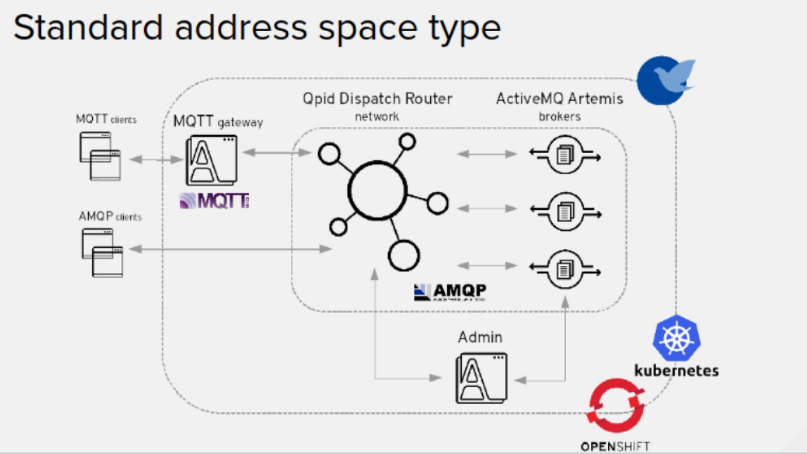
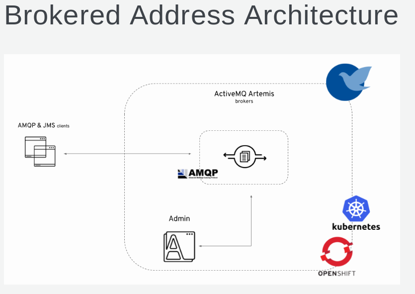

= POC ACTIVITIES

These are the activities related to an enmass based installation etc. of AMQ Brokers, MQ Interconnect

Resources:
* link:https://access.redhat.com/documentation/en-us/red_hat_amq/7.2/html-single/using_amq_online_on_openshift_container_platform/[Installing & Using AMQ Online]

Table 1.1. Supported features reference table

	Feature	 			Brokered address space	Standard address space
	----------------------------------------------------------------------------------
	Address type	Queue		Yes			Yes
			Topic		Yes			Yes
			Multicast	No			Yes
			Anycast		No			Yes
			Subscription	No			Yes
	Messaging 
	protocol	AMQP		Yes			Yes
			MQTT		Yes			Technology preview only
			CORE		Yes			No
			OpenWire	Yes			No
			STOMP		Yes			No
	Transports	TCP		Yes			Yes
			WebSocket	Yes			Yes
	Durable 
	subscriptions	JMS durable 
			subscriptions	Yes			No
			"Named" durable 
			subscriptions	No			Yes
	JMS		Transaction 
			support		Yes			No
			Selectors 
			on queues	Yes			No
			Message 
			ordering 
			guarantees 
			(including 
			prioritization)	Yes			No
	Scalability	Scalable 
			distributed 
			queues and 
			topics		No			Yes 

== STAGE 1:  Install all necessary components (templates, images/streams) and preps

* Create as system:admin (OCP admin) *amq-online-infra* namespace

* Install *AMQ Online* selecting on of the following option
** link:https://access.redhat.com/documentation/en-us/red_hat_amq/7.2/html-single/using_amq_online_on_openshift_container_platform/#installing-using-bundle-okd[Installing AMQ Online using a YAML bundle]
** link:https://access.redhat.com/documentation/en-us/red_hat_amq/7.2/html-single/using_amq_online_on_openshift_container_platform/#installing-using-ansible-okd[Installing AMQ Online using Ansible]
** link:https://access.redhat.com/documentation/en-us/red_hat_amq/7.2/html-single/using_amq_online_on_openshift_container_platform/#installing-using-manual-steps-okd[Installing AMQ Online manually]

	oc login -u system:admin
	oc new-project amq-online-infra
        cd /home/stkousso/Stelios/sw11/AMQ/Distros/AMQ-7/amq-online/install_and_examples
	oc apply -f install/bundles/amq-online

* Uninstalling *AMQ Online* selecting on of the following option
** link:scripts/amq-online-ocp-objects-delete.sh[]

== STAGE 2:  Address Space Reviews

=== STANDARD ADDRESS SPACE
* Address Types Allowed
** Queue
** Topic
** Multicast
** Anycast
** Subscription

 

=== BROKERED ADDRESS SPACE

* Address Types Allowed
** Queue
** Topic

 

== STAGE 3:  Configuring AMQ Online

=== Create/Configure Infrastructure Configs

* AMQ Online creates infrastructure components such as 
** routers, 
** brokers, and 
** consoles. 
These components can be configured while the system is running, and AMQ Online automatically updates the components with the new settings. The *AMQ Online service operator* can edit the AMQ Online default infrastructure configuration or create new configurations.
* Infrastructure configurations can be referred to from one or more *address space plans*.
* Infrastructure configuration can be managed for both *brokered* and *standard* infrastructure using *BrokeredInfraConfig* and *StandardInfraConfig* resources. 

==== BrokeredInfraConfig

* is used to configure infrastructure deployed by *brokered address spaces*. 
* is referenced by *address space plans* using a *enmasse.io/defined-by* annotation.

	apiVersion: admin.enmasse.io/v1alpha1
	kind: BrokeredInfraConfig
	metadata:
	  name: brokered-infra-config-example
	spec:
	  version: 0.23.0
	  admin:
	    resources:
	      memory: 256Mi
	  broker:
	    resources:
	      memory: 2Gi
	      storage: 100Gi
	    addressFullPolicy: PAGE

==== StandardInfraConfig

* is used to configure infrastructure deployed by *standard address spaces*. 
* is referenced by *address space plans* using a *enmasse.io/defined-by* annotation.

	apiVersion: admin.enmasse.io/v1alpha1
	kind: StandardInfraConfig
	metadata:
	  name: myconfig
	spec:
	  version: 0.23.0
	  admin:
	    resources:
	      memory: 256Mi
	  broker:
	    resources:
	      memory: 2Gi
	      storage: 100Gi
	    addressFullPolicy: PAGE
	  router:
	    resources:
	      memory: 256Mi
	    linkCapcity: 1000

=== Applying Infra Configs

* Before Applying amq-online-infra PODs

	NAME                                            READY     STATUS             RESTARTS   AGE
	pod/address-space-controller-7b79fcb7db-nd28r   0/1       ImagePullBackOff   0          2d
	pod/api-server-78cd849547-tbq89                 0/1       ImagePullBackOff   0          2d
	pod/keycloak-6f6ccc949f-g7m76                   0/1       Pending            0          2d
	pod/keycloak-controller-658c6b7bdb-nbcgm        0/1       ImagePullBackOff   0          2d
	pod/postgresql-1-deploy                         0/1       Error              0          2d
	
	NAME                                 DESIRED   CURRENT   READY     AGE
	replicationcontroller/postgresql-1   0         0         0         2d
	
	NAME                               TYPE        CLUSTER-IP       EXTERNAL-IP   PORT(S)             AGE
	service/address-space-controller   ClusterIP   172.30.200.206   <none>        8080/TCP            2d
	service/api-server                 ClusterIP   172.30.179.139   <none>        443/TCP,8080/TCP    2d
	service/postgresql                 ClusterIP   172.30.65.81     <none>        5432/TCP            2d
	service/standard-authservice       ClusterIP   172.30.130.8     <none>        5671/TCP,8443/TCP   2d
	
	NAME                                       DESIRED   CURRENT   UP-TO-DATE   AVAILABLE   AGE
	deployment.apps/address-space-controller   1         1         1            0           2d
	deployment.apps/api-server                 1         1         1            0           2d
	deployment.apps/keycloak                   1         1         1            0           2d
	deployment.apps/keycloak-controller        1         1         1            0           2d
	
	NAME                                                  DESIRED   CURRENT   READY     AGE
	replicaset.apps/address-space-controller-7b79fcb7db   1         1         0         2d
	replicaset.apps/api-server-78cd849547                 1         1         0         2d
	replicaset.apps/keycloak-6f6ccc949f                   1         1         0         2d
	replicaset.apps/keycloak-controller-658c6b7bdb        1         1         0         2d
	
	NAME                                            REVISION   DESIRED   CURRENT   TRIGGERED BY
	deploymentconfig.apps.openshift.io/postgresql   1          1         0         config,image(postgresql:9.6)

* After Applying amq-online-infra PODs

$ oc get standardinfraconfig.admin.enmasse.io/myconfig 
NAME       AGE
myconfig   10s
[stkousso@192 ocp-amq7-poc]$ oc get standardinfraconfig.admin.enmasse.io/myconfig -o yaml
apiVersion: admin.enmasse.io/v1alpha1
kind: StandardInfraConfig
metadata:
  creationTimestamp: 2018-12-10T12:51:37Z
  generation: 1
  name: myconfig
  namespace: amq-online-infra
  resourceVersion: "1522099"
  selfLink: /apis/admin.enmasse.io/v1alpha1/namespaces/amq-online-infra/standardinfraconfigs/myconfig
  uid: 54b53bfa-fc7a-11e8-b885-52540031a7e1
spec:
  admin:
    resources:
      memory: 256Mi
  broker:
    addressFullPolicy: PAGE
    resources:
      memory: 2Gi
      storage: 100Gi
  router:
    linkCapcity: 1000
    resources:
      memory: 256Mi
  version: 0.23.0

=== Create/Configure AddresSppacePlans

* Address space plans are used to configure quotas and control the resources consumed by address spaces. Address space plans are configured by the AMQ Online service operator and are selected when creating an address space.     

	oc create -f ./resources/amq-online-address-space-RESTRICTIVE.yaml
	oc get addressspaceplan.admin.enmasse.io/restrictive-plan -o yaml
		addressPlans:
		- small-queue
		- small-anycast
		addressSpaceType: standard
		apiVersion: admin.enmasse.io/v1alpha1
		displayName: Restrictive Plan
		displayOrder: 0
		kind: AddressSpacePlan
		longDescription: A plan with restrictive quotas for the standard address space
		metadata:
		  annotations:
		    enmasse.io/defined-by: default
		  creationTimestamp: 2018-12-10T11:22:46Z
		  generation: 1
		  labels:
		    app: enmasse
		  name: restrictive-plan
		  namespace: amq-online-infra
		  resourceVersion: "1500406"
		  selfLink: /apis/admin.enmasse.io/v1alpha1/namespaces/amq-online-infra/addressspaceplans/restrictive-plan
		  uid: eb9614a1-fc6d-11e8-b885-52540031a7e1
		resources:
		- max: 2
		  min: 0
		  name: router
		- max: 2
		  min: 0
		  name: broker
		- max: 2
		  min: 0
		  name: aggregate

* Address plans

	oc create -f ./resources/amq-online-address-plan-small-anycast.yaml
	oc get addressplan.admin.enmasse.io
		NAME            AGE
		small-anycast   1m
	oc get addressplan.admin.enmasse.io/small-anycast -o yaml

$ oc get all
NAME                                            READY     STATUS             RESTARTS   AGE
pod/address-space-controller-7b79fcb7db-nd28r   0/1       ImagePullBackOff   0          2d
pod/api-server-78cd849547-tbq89                 0/1       ImagePullBackOff   0          2d
pod/keycloak-6f6ccc949f-g7m76                   0/1       Pending            0          2d
pod/keycloak-controller-658c6b7bdb-nbcgm        0/1       ImagePullBackOff   0          2d
pod/postgresql-1-deploy                         0/1       Error              0          2d

NAME                                 DESIRED   CURRENT   READY     AGE
replicationcontroller/postgresql-1   0         0         0         2d

NAME                               TYPE        CLUSTER-IP       EXTERNAL-IP   PORT(S)             AGE
service/address-space-controller   ClusterIP   172.30.200.206   <none>        8080/TCP            2d
service/api-server                 ClusterIP   172.30.179.139   <none>        443/TCP,8080/TCP    2d
service/postgresql                 ClusterIP   172.30.65.81     <none>        5432/TCP            2d
service/standard-authservice       ClusterIP   172.30.130.8     <none>        5671/TCP,8443/TCP   2d

NAME                                       DESIRED   CURRENT   UP-TO-DATE   AVAILABLE   AGE
deployment.apps/address-space-controller   1         1         1            0           2d
deployment.apps/api-server                 1         1         1            0           2d
deployment.apps/keycloak                   1         1         1            0           2d
deployment.apps/keycloak-controller        1         1         1            0           2d

NAME                                                  DESIRED   CURRENT   READY     AGE
replicaset.apps/address-space-controller-7b79fcb7db   1         1         0         2d
replicaset.apps/api-server-78cd849547                 1         1         0         2d
replicaset.apps/keycloak-6f6ccc949f                   1         1         0         2d
replicaset.apps/keycloak-controller-658c6b7bdb        1         1         0         2d

NAME                                            REVISION   DESIRED   CURRENT   TRIGGERED BY
deploymentconfig.apps.openshift.io/postgresql   1          1         0         config,image(postgresql:9.6)

oc get BrokeredInfraConfigadmin.enmasse.io/BrokeredInfraConfig

